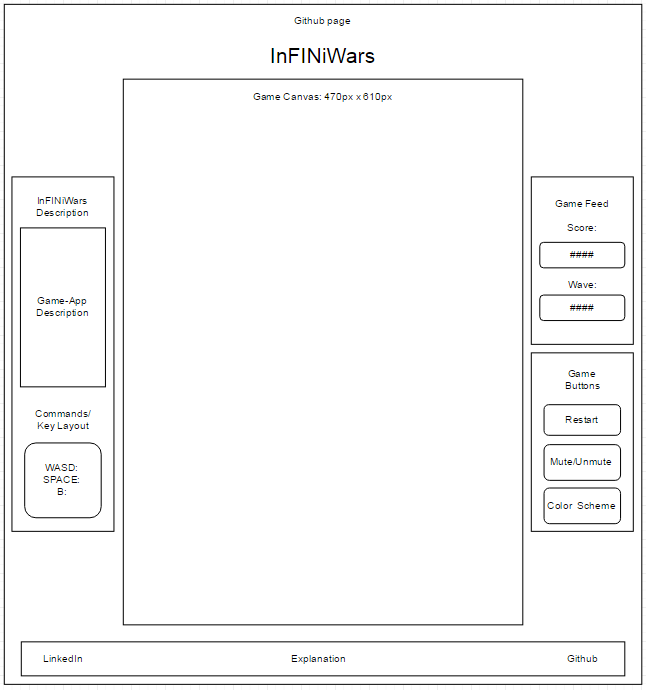

## InFINiWars: Space Invader Variation

### Background

InFINiWars is at its core the game of **Space Invaders**.  The original game is an arcade style, 1 player space-themed shooter.  The player uses a ship, or token to destroy incoming waves of space invaders, either to complete a level and progress forward, or rack up a high score.

In future developments, I plan to bring **Space Invaders** into the modern era by:

1. An increase in difficulty by speed and wave intervals,
2. Limiting the user on ammo as they progress level to level,
3. Eventually, requiring a player to combo attacks to win.

There are many variations on the **Space Invaders**.  This simulation will incorporate several of those variations, outlined in the **Functionality & MVP** and **Bonus Features** sections.

### Functionality & MVP

With this **Space Invaders** simulator, users will be able to:

- [ ] Start and reset the game board
- [ ] Move "spacecraft" and fire at enemies
- [ ] "Invaders" which move towards "spacecraft"
- [ ] See their score and and hear sounds

In addition, this project will include:

- [ ] A progress/level modal allowing the user move amp  up the difficulty/progress
- [ ] A production Readme

### Wireframes

This app will consist of a single screen with game canvas, game controls, and nav links to the Github, my LinkedIn, and the About modal.  Game controls will include Start, Reset, and mute buttons.  On the left, there will be lore about the game, as well as the momvement schema.  On the right, there will be a livefeed for user progress, as well as the button overlay for features mentioned above.  Additionally, the game will have a modal  appear prompting to continue game.

### Architecture and Technologies

This project will be implemented with the following technologies:

- Vanilla JavaScript and `jquery` for overall structure and game logic,
- `Easel.js` with `HTML5 Canvas` for DOM manipulation and rendering,
- `jQuery Hotkeys Plugin` for cross-browser key handling.
- Webpack to bundle and serve up the various scripts.

In addition to the webpack entry file, there will be six scripts involved in this project:

`Infiniwars.js`: this script will handle the logic for creating and updating the necessary `Easel.js` and `Canvas.js` elements and rendering them to the DOM. `Game.js` also handles `Sound.js` elements.

`Spacecraft.js`: this script will handle the logic behind the scenes.  A Spacecraft object will use a Projectile and its own movement scheme.

`Invader.js`: this script will be the enemy object displayed on render and their related actions. An Invader will also use Projectile and its own movement scheme.

`Projectile.js`: this script is the projectile or bullet being shot out of enemies and spacecraft. This will be bound to movements and/or actions done by Spacecraft.

`Collision.js`: this script with be in charge of handling collision. In essence, the projects from the ship as well as enemy objects.

`Game_status.js`: this script  will house the necessary variables to provide feedback to user, as well as the prompts for game play.

### Implementation Timeline

**Day 1**: Setup all necessary Node modules, including getting webpack up and running and `Easel.js` installed.  Create `webpack.config.js` as well as `package.json`.  Write a basic entry file and the bare bones of all 4 scripts outlined above.  Learn the basics of `Easel.js`.  Goals for the day:

- Get a green bundle with `webpack`
- Learn enough `Easel.js` to render an object to the `Canvas` element

**Day 2**: Dedicate this day to learning the `Easel.js` API.  First, build out the various `Canvas` related objects.  Then, render at least one form of game to test general layout of game status. One working level should allow for bug testing of overall code. Goals for the day:

- Complete the base game rendering logic
- Begin styling and work on game state storage
- Get at least one working level with starting parameters

**Day 3**: Create the remaining parameters to the game. Complete styling of `Game` with working sound experience and functionality. Goals are to:

- Verify sound functions as intended
- Verify button, modal prompt, and game functionality
- Verify natural game progression for better user experience

**Day 4**: Finish styling and bug testing. Verify potential errors and design flaws for rapid improvement. Find a natural limit for game progression.

### Bonus features

There are many directions this **Space Invaders** replica could eventually go.  Some anticipated updates are:

- [ ] Get realtime feedback for scores and wave clears
- [ ] Increasing movement and fire-back rate from "Invaders"
- [ ] Add options for different modes and player-limitations
- [ ] Introduce dynamic canvas schemes from retro to modern
